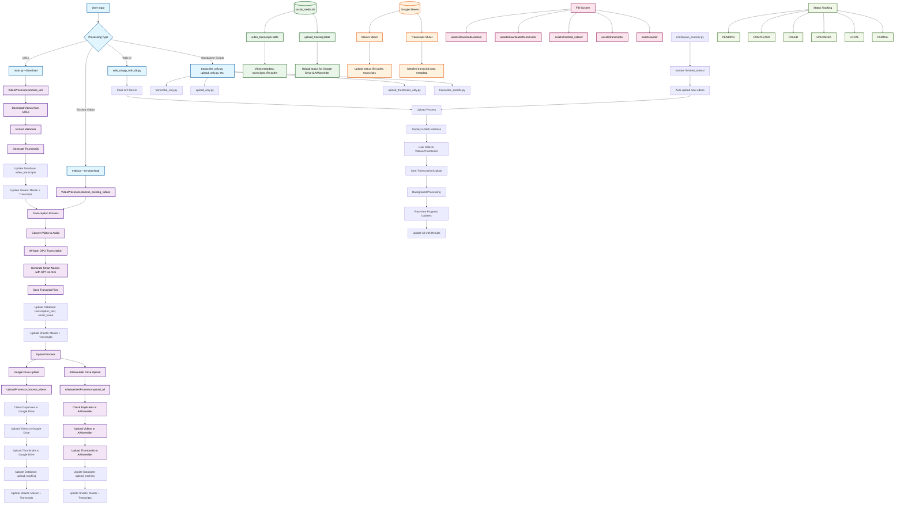

# 🚀 Social Media Content Processor - Complete System Flow Diagram

## 📊 Mermaid Diagram

## 🎯 **Complete System Flow Overview:**

### **1. Entry Points:**
- **main.py** - Full pipeline with/without download
- **Web UI** - Interactive browser interface
- **Standalone Scripts** - Individual operations

### **2. Download Flow:**
- Download videos from URLs
- Extract metadata (title, description, duration, etc.)
- Generate thumbnails
- Update database and sheets

### **3. Transcription Flow:**
- Convert video to audio
- GPU-accelerated Whisper transcription
- Generate smart names with GPT-4o-mini
- Save transcript files
- Update database and sheets

### **4. Upload Flow:**
- **Google Drive Upload** - Videos and thumbnails
- **AIWaverider Drive Upload** - Videos and thumbnails
- Duplicate checking for both platforms
- Update database and sheets after each upload

### **5. Database Structure:**
- **video_transcripts** - Video metadata, transcripts, file paths
- **upload_tracking** - Upload status for both platforms

### **6. Google Sheets:**
- **Master Sheet** - Upload status, file paths, transcripts
- **Transcripts Sheet** - Detailed transcript data

### **7. File System:**
- **assets/downloads/videos/** - Downloaded videos
- **assets/downloads/thumbnails/** - Generated thumbnails
- **assets/finished_videos/** - Processed videos ready for upload
- **assets/transcripts/** - Transcript files
- **assets/audio/** - Audio files for transcription

### **8. Continuous Processing:**
- **continuous_scanner.py** - Monitors finished_videos/ for auto-upload

### **9. Status Tracking:**
- **PENDING** - Waiting for processing
- **COMPLETED** - Successfully processed
- **FAILED** - Processing failed
- **UPLOADED** - Successfully uploaded
- **LOCAL** - Available locally only
- **PARTIAL** - Partially uploaded

## 🔧 **How to Use This Diagram:**

1. **Copy the Mermaid code** from the code block above
2. **Paste it into** any Mermaid-compatible tool:
   - [Mermaid Live Editor](https://mermaid.live/)
   - [GitHub/GitLab** (supports Mermaid natively)
   - **VS Code** with Mermaid extension
   - **Notion** with Mermaid blocks
   - **Obsidian** with Mermaid plugin

3. **View the interactive diagram** with full zoom, pan, and styling

## 📝 **Key Features Shown:**

- ✅ **Complete data flow** from input to output
- ✅ **Database relationships** and table structures
- ✅ **File system organization** and paths
- ✅ **Status tracking** throughout the process
- ✅ **Parallel processing** for uploads
- ✅ **Error handling** and retry logic
- ✅ **Real-time updates** via Web UI
- ✅ **Standalone script** integration

This diagram provides a comprehensive visual representation of the entire social media content processor system architecture and workflow.
